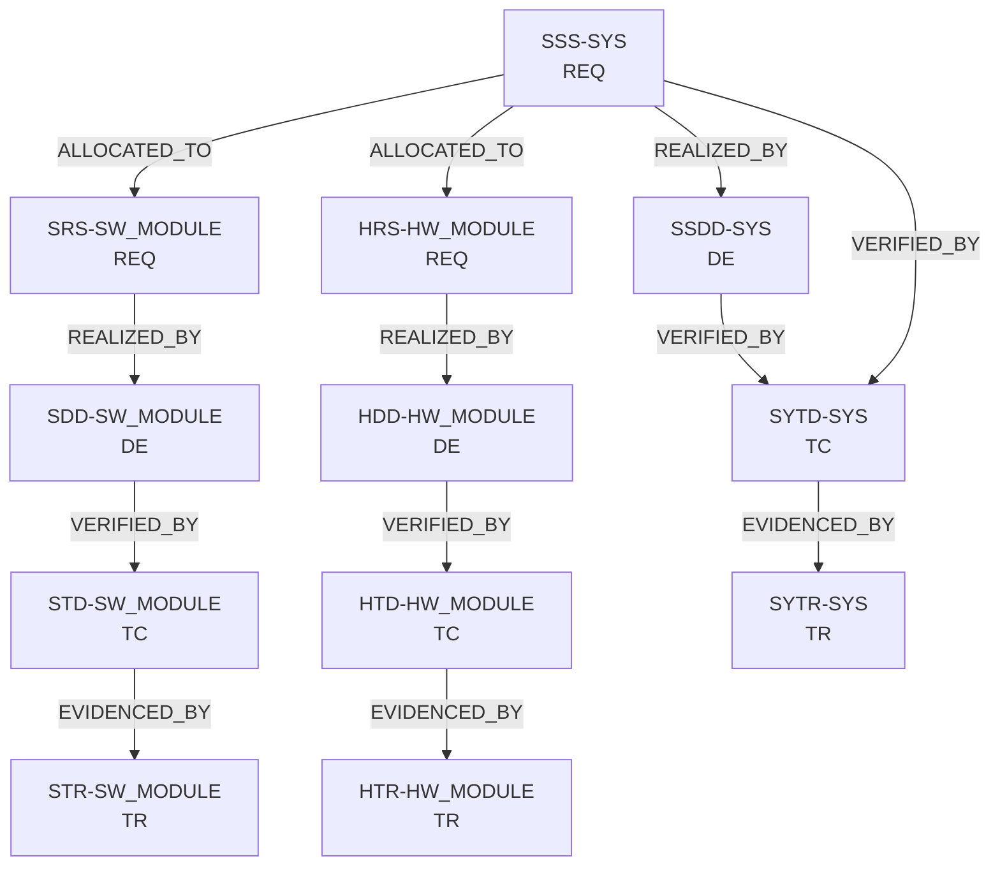

# Lifecycle Model (Verification-Centric V-Model)

<!-- TRACEABILITY_IDS -->

## 1. Purpose

This document defines the normative lifecycle model used in this project.

The lifecycle is based on MIL-STD-498 principles and follows a
Verification-centric V-Model structure. It establishes:

- Artifact hierarchy
- Responsibility boundaries
- Traceability expectations
- Baseline control points

This document is normative.

---

## 2. Lifecycle Philosophy

The lifecycle follows a structured V-Model:

- The left side defines specification and design artifacts.
- The right side defines verification artifacts and objective evidence.
- Traceability is mandatory between corresponding abstraction levels.
- No artifact exists without upstream or downstream linkage.

The model is verification-centric. Validation is implemented as a
specialized form of system-level verification.

---

## 3. V-Model Structure

### 3.1 Left Side — Specification and Design

1. **System / Product Requirements**
   - Artifact: `SSS-SYS`
   - Elements: `REQ`
   - Defines product-level functional and non-functional requirements.
   - Acts as the root of traceability.

2. **Derived Requirements (Allocation Level)**
   - Software: `SRS-SW_MODULE`
   - Hardware: `HRS-HW_MODULE`
   - Derived from SSS via explicit allocation.
   - Every derived requirement shall trace to at least one SSS requirement.

3. **System Architecture**
   - Artifact: `SSDD-SYS`
   - Elements: `DE`
   - Defines system decomposition and major interfaces.

4. **Detailed Design**
   - Software: `SDD-SW_MODULE`
   - Hardware: `HDD-HW_MODULE`
   - Each design element shall trace to at least one requirement.

---

### 3.2 Right Side — Verification and Evidence

1. **Test Design (Test Cases)**
   - Software: `STD-SW_MODULE`
   - Hardware: `HTD-HW_MODULE`
   - System: `SYTD-SYS`
   - Elements: `TC`
   - Each test case shall verify at least one requirement or design element.

2. **Test Execution and Evidence (Test Reports)**
   - Software: `STR-SW_MODULE`
   - Hardware: `HTR-HW_MODULE`
   - System: `SYTR-SYS`
   - Elements: `TR`
   - Each test report entry shall reference an executed test case.

---

### 3.3 V-Model Diagram (Mermaid)



---

### 3.4 V-Model Diagram (ASCII Reference)

The following ASCII representation is normative for environments where
Mermaid rendering is not available.

```text
Left side (definition/design)
  SSS-SYS (REQ)
    |--REALIZED_BY-->  SSDD-SYS (DE)
    |--ALLOCATED_TO--> SRS-SW_MODULE (REQ) --REALIZED_BY--> SDD-SW_MODULE (DE)
    |--ALLOCATED_TO--> HRS-HW_MODULE (REQ) --REALIZED_BY--> HDD-HW_MODULE (DE)

Right side (verification/evidence)
  SDD-SW_MODULE (DE) --VERIFIED_BY--> STD-SW_MODULE (TC)
    --EVIDENCED_BY--> STR-SW_MODULE (TR)
  HDD-HW_MODULE (DE) --VERIFIED_BY--> HTD-HW_MODULE (TC)
    --EVIDENCED_BY--> HTR-HW_MODULE (TR)
  SSS-SYS / SSDD-SYS --VERIFIED_BY--> SYTD-SYS (TC)
    --EVIDENCED_BY--> SYTR-SYS (TR)
```

---

## 4. Logical Mapping (Left-to-Right Correspondence)

| Left Side Artifact | Right Side Artifact | Purpose |
|--------------------|--------------------|---------|
| SSS-SYS            | SYTD-SYS           | System verification |
| SRS-*              | STD-*              | Software verification |
| HRS-*              | HTD-*              | Hardware verification |
| SDD-*              | STD-*              | Design-level verification |
| HDD-*              | HTD-*              | Design-level verification |

System-level requirements shall be verified at system level.
Derived requirements shall be verified within their respective domain.

---

## 5. Verification vs Validation

### 5.1 Verification

Verification answers:

"Did we build the system correctly?"

Verification is demonstrated by:

- Requirement-to-test traceability
- Objective evidence (TR)
- Inspection / Analysis / Demonstration / Test methods

Verification occurs at:

- Software level
- Hardware level
- System level

---

### 5.2 Validation

Validation answers:

"Did we build the correct system?"

In this project:

- Validation is implemented at system level.
- Acceptance-oriented system test scopes represent validation activities.
- No separate validation DID is defined.

Validation is therefore treated as a specialization of system-level
verification.

---

## 6. Baseline Control Points

Lifecycle progression is controlled through progressive baselines:

- **B0 — SSS Baseline**  
  Product requirements frozen under configuration control.  
  B0 shall only be established after completion of the pre-baseline requirement
  capture activity that transforms stakeholder needs, product objectives, scope,
  constraints, and operational scenarios into a controlled `SSS-SYS.md`
  baseline candidate.  
  The pre-baseline workflow is described in
  `docs/10_lifecycle/t0_b0/b0_requirement_capture_process.md`. B0 readiness and
  the final `Go` / `Hold` decision are governed by
  `docs/10_lifecycle/t0_b0/b0_readiness_review.md`.

- **B1 — Derived Requirements Baseline**  
  SRS and HRS consistent with SSS allocation.

- **B2 — Architecture Baseline**  
  System architecture (SSDD) approved.

- **B3 — Detailed Design Baseline**  
  SDD and HDD complete and reviewed.

- **B4 — Test Design Readiness**  
  STD/HTD/SYTD coverage reviewed against requirements.

- **B5 — Verification Evidence Readiness**  
  STR/HTR/SYTR demonstrate closure of verification obligations.

All baselines are established under configuration management control.

---

## 7. Traceability Rules

1. No orphan requirements.
2. No orphan design elements.
3. No orphan test cases.
4. Every test case requires objective evidence.
5. Allocation relationships shall be explicit.
6. System requirements shall have system-level verification.

---

## 8. Compliance Statement

This lifecycle model:

- Aligns with MIL-STD-498 principles.
- Preserves clear separation between specification, design, and verification.
- Enables deterministic traceability.
- Supports structured configuration control.

Deviation from this lifecycle requires formal approval.

---

## 9. Change History

| Version | Date       | Description |
| ------- | ---------- | ----------- |
| v0.1    | 2026-02-19 | Add normative verification-centric V-model lifecycle definition |
| v0.2    | 2026-03-13 | Normalize planned B0 requirement capture process path to repo naming style |
| v0.3    | 2026-03-16 | Point B0 pre-baseline workflow reference to the lifecycle section |
| v0.4    | 2026-03-16 | Link the B0 baseline point to both capture and readiness review workflows |

---

## 10. Last Modified

**Last modified:** 2026-03-16 00:00 +03
